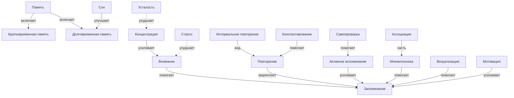

# Как запоминать материал

## Описание раздела

Этот раздел энциклопедии посвящён тому, как работает запоминание и как можно учиться легче и эффективнее. Он помогает понять, почему одни вещи запоминаются быстро, а другие — с трудом, и какие приёмы действительно помогают улучшить память. Раздел охватывает базовые понятия о памяти, методы обучения и факторы, влияющие на усвоение знаний. Все материалы написаны простым и понятным языком для школьников.

## Цель работы

В рамках лабораторной работы по курсу «Искусственный интеллект» было сделано:

- выделены 18 ключевых понятий, связанных с запоминанием материала;
- построена онтология предметной области с иерархическими и горизонтальными связями;
- написаны 18 энциклопедических статей с помощью генеративного ИИ;
- установлены перекрёстные ссылки между всеми статьями;
- найдены и использованы данные из структурированных источников знаний (Wikidata, DBpedia);
- подготовлены SPARQL-запросы для извлечения информации;

## Состав группы

| Участник |
|----------|
| Ковриженков Дмитрий |
| Еряшев Алексей | 
| Севастьянов Иван | 
| Снетков Никита |
| Тертычный Олег | 

## Список понятий

- Запоминание
- Память
- Долговременная память
- Кратковременная память
- Внимание
- Концентрация
- Повторение
- Интервальное повторение
- Активное вспоминание
- Мнемотехника
- Ассоциации
- Визуализация
- Конспектирование
- Самопроверка
- Сон
- Усталость
- Стресс
- Мотивация

## Концептуализация предметной области

В данной предметной области выделены следующие группы сущностей:

- **Базовые понятия**: запоминание, память;
- **Виды памяти**: кратковременная память, долговременная память;
- **Когнитивные процессы**: внимание, концентрация;
- **Методы обучения**: повторение, интервальное повторение, активное вспоминание;
- **Приёмы работы с информацией**: мнемотехника, ассоциации, визуализация, конспектирование, самопроверка;
- **Факторы состояния**: сон, усталость, стресс, мотивация.

### Типы связей

Помимо иерархических связей (включает, вид, часть), в онтологии используются горизонтальные связи разных видов:

| Тип связи | Пример |
|-----------|--------|
| **помогает** | Внимание → помогает → Запоминание |
| **усиливает** | Концентрация → усиливает → Внимание |
| **закрепляет** | Повторение → закрепляет → Запоминание |
| **улучшает** | Сон → улучшает → Долговременная память |
| **ухудшает** | Усталость → ухудшает → Концентрация |
| **мешает** | Стресс → мешает → Внимание |
| **включает** | Память → включает → Кратковременная память |
| **вид** | Интервальное повторение → вид → Повторение |
| **часть** | Ассоциации → часть → Мнемотехника |

## Онтология раздела



## Таблица понятий

| Понятие | Описание | Связанные понятия | Файл |
|---------|----------|-------------------|------|
| Запоминание | Сохранение информации в памяти | Память, Внимание, Повторение, Мотивация | zapominanie.md |
| Память | Хранение и воспроизведение информации | Запоминание, КП, ДП, Внимание | pamyat.md |
| Долговременная память | Длительное хранение знаний | Память, КП, Повторение, Сон | dolgovremennaya_pamyat.md |
| Кратковременная память | Краткое удержание информации | Память, ДП, Внимание, Концентрация | kratkovremennaya_pamyat.md |
| Внимание | Фокусировка на информации | Запоминание, Концентрация, Стресс, Усталость | vnimanie.md |
| Концентрация | Длительное удержание внимания | Внимание, Усталость, Стресс, Мотивация | koncentraciya.md |
| Повторение | Многократное обращение к материалу | Запоминание, ИП, АВ, ДП | povtorenie.md | 
| Интервальное повторение | Повторение через промежутки | Повторение, ДП, АВ, Самопроверка | intervalnoe_povtorenie.md |
| Активное вспоминание | Воспроизведение без подсказок | Повторение, Самопроверка, ДП, Запоминание | aktivnoe_vspominanie.md |
| Мнемотехника | Приёмы для облегчения запоминания | Ассоциации, Визуализация, Запоминание, Память | mnemotehnika.md |
| Ассоциации | Связи между образами и знаниями | Мнемотехника, Визуализация, Запоминание, ДП | associacii.md | 
| Визуализация | Образное представление информации | Мнемотехника, Ассоциации, Конспектирование | vizualizaciya.md |
| Конспектирование | Краткая запись ключевых идей | Повторение, Самопроверка, Визуализация, АВ | konspektirovanie.md |
| Самопроверка | Проверка знаний без подсказок | АВ, Повторение, ИП, Конспектирование | samoproverka.md |
| Сон | Отдых и обработка информации мозгом | ДП, Запоминание, Усталость, Концентрация | son.md | 
| Усталость | Снижение энергии и внимания | Сон, Концентрация, Внимание, Стресс | ustalost.md |
| Стресс | Напряжение, мешающее учиться | Внимание, Концентрация, Усталость, Мотивация | stress.md | 
| Мотивация | Побуждение к обучению | Запоминание, Повторение, Внимание, Самопроверка | motivaciya.md | 

## Использование структурированных источников знаний

В проекте использовались открытые базы знаний для обоснования и верификации материала:

- **Wikidata** — структурированная база знаний, содержащая данные о понятиях, их свойствах и связях;
- **DBpedia** — проект, извлекающий структурированные данные из Википедии.

## Примеры SPARQL-запросов

### Запрос 1: описания всех понятий раздела

```sparql
SELECT ?item ?itemLabel ?itemDescription WHERE {
  VALUES ?item {
    wd:Q1065742 wd:Q492 wd:Q211548 wd:Q208195
    wd:Q107561 wd:Q1061588 wd:Q844569 wd:Q831482
    wd:Q7157438 wd:Q544531 wd:Q188444 wd:Q1413415
    wd:Q7382 wd:Q9690 wd:Q12078 wd:Q179289
  }
  SERVICE wikibase:label { bd:serviceParam wikibase:language "ru,en". }
}
```

### Запрос 2: подклассы понятия «Память» (Memory)

```sparql
SELECT ?subclass ?subclassLabel ?subclassDescription WHERE {
  ?subclass wdt:P279 wd:Q492 .
  SERVICE wikibase:label { bd:serviceParam wikibase:language "ru,en". }
}
```

### Запрос 3: свойства и связи понятия «Интервальное повторение»

```sparql
SELECT ?property ?propertyLabel ?value ?valueLabel WHERE {
  wd:Q831482 ?prop ?value .
  ?property wikibase:directClaim ?prop .
  SERVICE wikibase:label { bd:serviceParam wikibase:language "ru,en". }
}
```

## Использование LLM

Для генерации статей использовалась языковая модель **ChatGPT** компании OpenAI.

Процесс работы:

1. **Промпты** формулировались по единому шаблону, включающему:
   - описание проекта и аудитории;
   - полную карту файлов и путей для корректных внутренних ссылок;
   - список обязательных связанных понятий для каждой статьи;
   - требования к структуре: вступление, объяснение, пример из жизни, практические советы, таблица «помогает / мешает», частые ошибки, связь с другими понятиями, интересный факт, раздел «см. также».

2. **Генерация**: каждая статья генерировалась отдельным запросом с указанием конкретного понятия и его обязательных связей.

3. **Проверка**: каждая статья проверялась вручную на:
   - корректность внутренних ссылок;
   - отсутствие псевдонауки и выдуманных фактов;
   - доступность языка для целевой аудитории;
   - наличие достаточного числа перекрёстных ссылок.

## Перекрёстные ссылки

Все 18 статей расположены в одной папке:

```
WEB/how_to_memorize/articles/
```

Благодаря этому ссылки между статьями оформляются единообразно:

```markdown
[Память](./pamyat.md)
[Сон](./son.md)
[Повторение](./povtorenie.md)
```

В каждой статье содержится:
- 5–8 естественных внутренних ссылок в тексте;
- 4–7 ссылок в разделе «См. также».

Леммы в concepts.json содержат различные словоформы каждого понятия (падежи, глагольные формы, синонимы), что позволяет находить упоминания терминов в разных контекстах.

## Структура файлов

```text
WORK/how_to_memorize/
  README.md
  concepts.json
  
WEB/how_to_memorize/
  articles/
    zapominanie.md
    pamyat.md
    kratkovremennaya_pamyat.md
    dolgovremennaya_pamyat.md
    vnimanie.md
    koncentraciya.md
    povtorenie.md
    intervalnoe_povtorenie.md
    aktivnoe_vspominanie.md
    mnemotehnika.md
    associacii.md
    vizualizaciya.md
    konspektirovanie.md
    samoproverka.md
    son.md
    ustalost.md
    stress.md
    motivaciya.md
```

## Итоги

В результате работы был создан полноценный раздел энциклопедии по теме «Как запоминать материал». Раздел содержит 18 связанных между собой статей, каждая из которых написана понятным языком для школьников. Была построена онтология предметной области, включающая как иерархические связи (виды памяти, методы обучения), так и горизонтальные (помогает, ухудшает, усиливает, зависит от). Для всех понятий найдены соответствующие сущности в Wikidata и DBpedia, что подтверждает научную обоснованность выбранных тем. Подготовлены SPARQL-запросы для извлечения дополнительной информации из баз знаний. В дальнейшем раздел можно улучшить, добавив иллюстрации и схемы к каждой статье, расширив описания методов обучения практическими упражнениями и интегрировав раздел с другими темами энциклопедии KidBook.
